:orphan:

IEEE 802.11 Quality of Service
==============================

Goals
-----

The IEEE 802.11 MAC has Quality of service (QoS) features, i.e. packets can belong
to different priority categories, with higher priority packets being more
likely to be sent before lower priority packets. This feature is useful for
applications which require a certain service quality, e.g. low delay, such as
VoIP or live video streaming. IEEE 802.11 MAC-level QoS can also supplement QoS features
on other levels of the protocol stack, such as DiffServ on the IP level.

This showcase demonstrates the QoS features of the 802.11 MAC model in INET,
with example simulations.

| INET version: ``4.0``
| Source files location: `inet/showcases/wireless/qos <https://github.com/inet-framework/inet-showcases/tree/master/wireless/qos>`__

About 802.11 QoS
----------------

The MAC uses the Enhanced distributed channel access (EDCA) technique -
which is part of the Hybrid coordination function (HCF) - to implement
the QoS features, instead of the Distributed coordination function (DCF).
Packets are classified into four access categories, each with a different
priority. The categories from lowest to highest priority are the following:

- Background
- Best effort
- Video
- Voice

Each access category has its own packet queue. Higher priority packets have a
higher chance of being sent than lower priority ones, because the MAC waits
less before sending the higher priority packets, i.e. the contention backoff duration is lower.
Also, the higher priority packets have a shorter contention window,
and longer transmit opportunity (TXOP) duration.

In INET, the 802.11 QoS features can be enabled by setting the :par:`qosStation`
parameter to ``true`` in :ned:`Ieee80211Mac`. When this parameter is set to ``true``,
the MAC uses the :ned:`Hcf` submodule, instead of :ned:`Dcf`.

Also, a classifier module is required to sort packets into access categories.
The classifier is an optional submodule of :ned:`Ieee80211Interface`
The example simulation uses the :ned:`QosClassifier` module for this purpose.
:ned:`QosClassifier` classifies packets according to their source and
destination ports. The port-access category mapping is according to the classifier's parameters.
By default, the mapping is the following:

- port 21: background
- port 80: best effort
- port 4000: video
- port 5000: voice

If either a packet's source or destination port matches one of the above ports,
the packet is classified into that category.

.. note:: QoS needs to be enabled in all devices that partake in the communication, because
          otherwise some of them wouldn't be able to make sense of some of the features that the
          :ned:`Hcf` might use, such as block acknowledgement requests, TXOP, aggregate frames, etc.

The Model
---------

The showcase contains an example simulation featuring a wireless network,
with two hosts communicating through an access point. One of the hosts
sends data to the other via UDP, using four UDP applications, each
corresponding to an access category. The simulation will be run with
QoS disabled, then with QoS enabled. There are also two traffic scenarios. In the first one,
the four applications have equal bitrates, and the bitrate for each application is high enough
to saturate the channel on its own. The second traffic scenario features realistic bitrates,
e.g. the voice data rate is less than the video data rate. Thus there are four cases:

- Equal bitrate / Non-QoS
- Equal bitrate / QoS
- Realistic bitrate / Non-QoS
- Realistic bitrate / QoS

After running the simulations, we analyze the results. We take a look at the following metrics:

- End-to-end delay
- Instantaneous packet delay variation: the difference between the end-to-end delay of consecutive packets, effectively jitter
- Application level throughput

These metrics for each priority category can be analyzed and compared, examining how QoS affects
and improves them.

It is expected that there will be no difference between the access categories in the non-QoS cases,
because the MAC doesn't differentiate between them. Also, there should be less delay and higher
throughput for the higher priority packets in the QoS cases.

The configuration
~~~~~~~~~~~~~~~~~

The example simulation uses the following network:

.. figure:: network4.png
   :width: 100%
   :align: center

It contains two :ned:`WirelessHost`'s, named ``client`` and ``server``,
and an :ned:`AccessPoint`. It also contains an :ned:`Ieee80211ScalarRadioMedium`,
an :ned:`Ipv4NetworkConfigurator` and an :ned:`IntegratedVisualizer` module.

The client host is configured to send UDP packets to the server host.
Each UDP application sends packets to a different UDP port, corresponding to the access categories.
Here is the port configuration in :download:`omnetpp.ini <../omnetpp.ini>`:

.. literalinclude:: ../omnetpp.ini
   :start-at: client.numApps = 4
   :end-at: client.app[3].packetName
   :language: ini

The server hosts have four :ned:`UdpSink` applications, which receive the packets
on the different ports:

.. literalinclude:: ../omnetpp.ini
   :start-at: server.numApps
   :end-at: app[3]
   :language: ini

In the equal bitrate traffic scenario, the traffic of all four applications is the same,
about 24 Mbps, so just one application alone could saturate the channel (the PHY rate is set to 54 Mbps).
Here is the configuration:

.. literalinclude:: ../omnetpp.ini
   :start-at: # 24Mbps
   :end-at: sendInterval
   :language: ini

In the realistic traffic scenario, traffic is set up realistically, e.g. the voice application sends
less data than the video application. The traffic
configuration is the following:

.. literalinclude:: ../omnetpp.ini
   :start-at: background -
   :end-at: client.app[3].sendInterval =
   :language: ini

The simulations for the four cases are in the following configurations:

- ``EqualBitrateNonQos``
- ``EqualBitrateQos``
- ``RealisticBitrateNonQos``
- ``RealisticBitrateQos``

Results
-------

We take a look at the results after running the simulations. First, we examine the results for
the equal bitrate cases, then for the realistic bitrate ones.

Equal bitrate traffic
~~~~~~~~~~~~~~~~~~~~~

Here are the results for the equal bitrate traffic scenario, both with and without QoS:

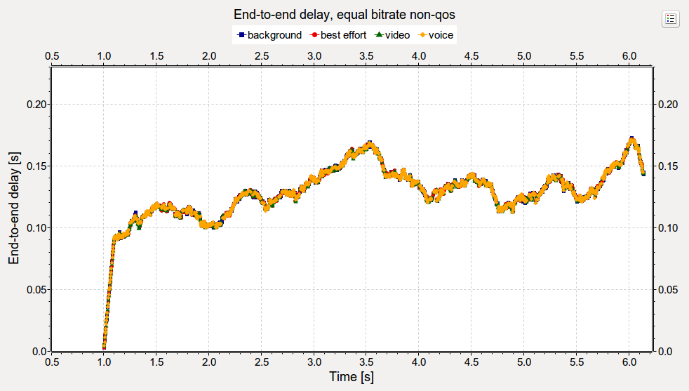

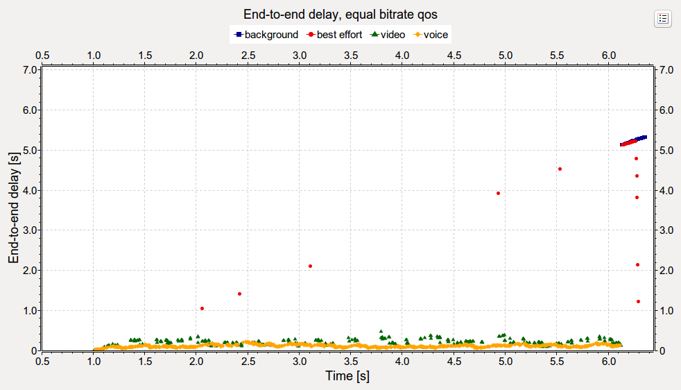

In the non-QoS case, the end-to-end delay vector data points for the four access categories run together.
There is no difference between the access categories, all of them are treated the same by the MAC.
The curve is straight and steep at the beginning, due to the queue being filled up. When it is
already filled up, the curve starts to fluctuate. The delay is around 150 ms. There is more traffic
generated by the UDP applications than the channel can carry, thus the queue stays filled up,
and packets are dropped. Note that dropped packets are not indicated on the charts,
as we're plotting UDP packets received by ``server``.

In the QoS case, as expected, the higher priority access categories (video, voice) have lower
delay, because they are often sent before the lower priority ones. (they are more likely to be
sent first.)

   The delay of the voice stream is about the same as the delay in the non-QoS case,
   around 150 ms. Here is the same chart zoomed in on the video and voice data points:

   .. figure:: equalnonqos_zoomed.png
      :width: 100%

The best effort and background packets barely get sent at the beginning. When some of them do get sent,
they have been waiting for seconds in the queue. The traffic generation stops at
around 6 seconds. After the video and voice priority packets remaining in the queues
are transmitted, the background and best effort packets are sent as well.

The data points for the background and best effort categories follow a linear trend,
as the first 100 packets are queued in the beginning and stay in the queue, not getting
the chance to be sent. So basically, the creation time of all the packets in the queue
is about the same. Rarely it happens that a
packet from the lower priority queue gets sent, so another one - created at a later time -
can take its place in the queue. The last of the earliest packets get sent at
around 7 seconds (after waiting in the queue for 6). From now on, there is a drop in the delay,
because these packets got to the queue later.

Next, we look at the instantaneous packet delay variation (jitter):

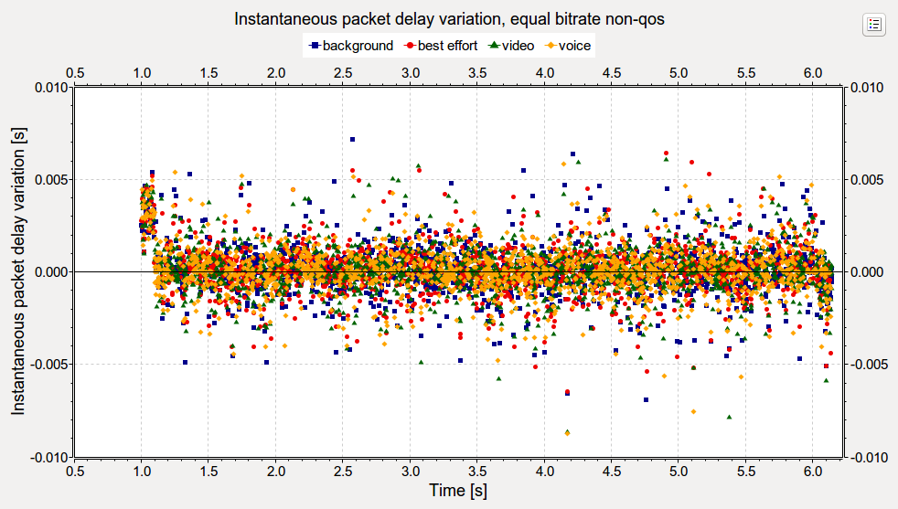

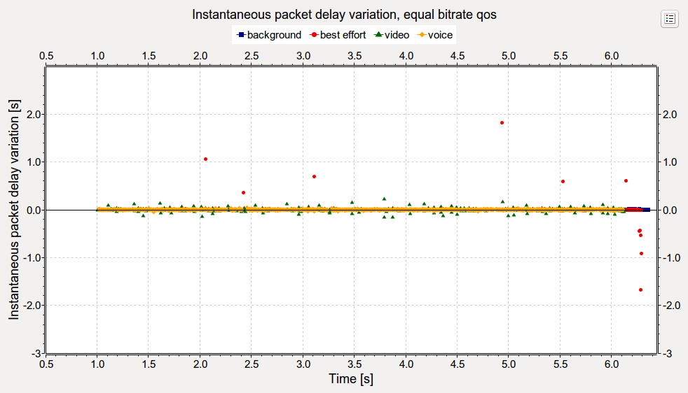

The jitter data points are scattered with the same pattern for all four traffic
categories in the non-QoS case. In the QoS case, the jitter is low for the video
and voice categories (lowest for voice), and high for background and best effort. Actually, at the
beginning of the simulation, there are very few background and best effort packets
sent, thus there are very few data points. After the video and voice traffic stops,
the background and best effort categories have the same low jitter as the high
priority categories had.

The jitter for all access categories in the non-QoS case, and for the video and voice in the QoS
case are about the same, around 1 ms.
In the QoS case, the decreasing jitter of best effort at the end is because of the decreasing delay,
as shown on the delay chart.

Next, let's take a look at the application level throughput:

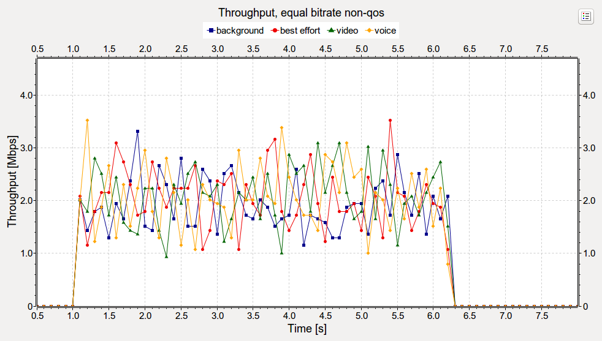

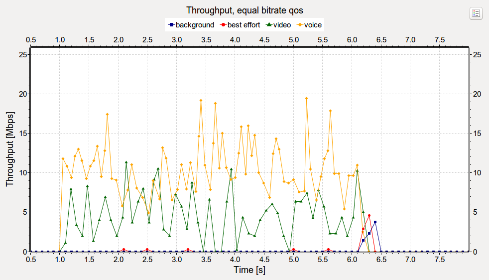

As expected, the throughput in the non-QoS case is the same for all four access categories,
as they are treated the same by the MAC. In the QoS case, the video and voice categories own the channel
most of the time and thus have high throughput, compared to the low throughput of background
and best effort.

   The MAC prioritizes the video and voice categories above the others. For example, by default,
   the background and best effort categories don't have TXOP, they can send just one frame before
   having to contend for the channel. The video and voice categories have a max TXOP duration of
   3 and 1.5 ms, respectively.

After the traffic stops and the remaining high priority packets are sent,
the packets left in the lower priority queues can be transmitted.

.. note:: The traffic passes through an access point, so the throughput is lower than it would be if the hosts
          were communicating directly.

Realistic bitrate traffic
~~~~~~~~~~~~~~~~~~~~~~~~~

Now, let's see the same charts as in the previous section for the realistic traffic scenario.
Here are the results for both the non-QoS and QoS cases:

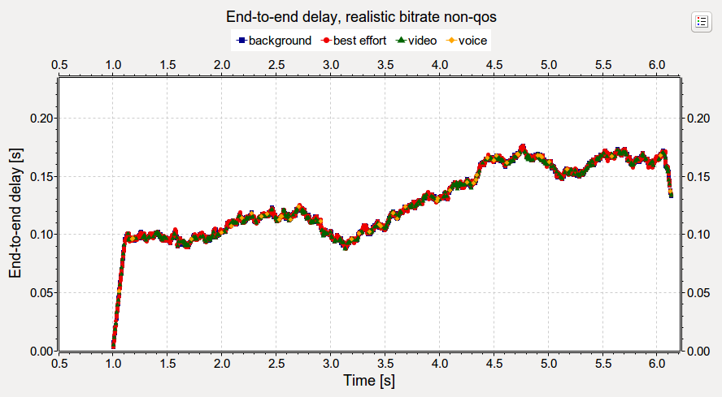

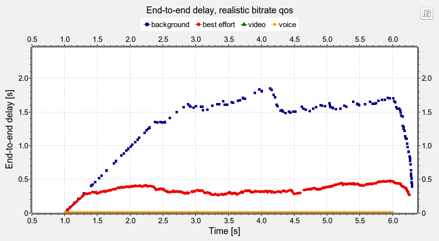

The chart for the non-QoS case is very similar to the one for the equal bitrate traffic non-QoS case.
The traffic for the different traffic categories are not differentiated.

In the QoS case, the delay for the high priority access categories (voice, video) is low,
but there are more lower priority packets sent than in the equal bitrate case.
The reason is that the high priority traffic has lower bitrate than in the equal bitrate case,
and doesn't saturate the channel. There is more bandwidth available for the lower priority packets.

The best effort category is prioritized over the background priority, the best effort has lower delay.
At around 1.3 seconds, the best effort queue runs out of the earliest packets, and the delay starts to
fluctuate more. The same happens to the background queue at around 2.5 seconds.

Now lets take a look at jitter:

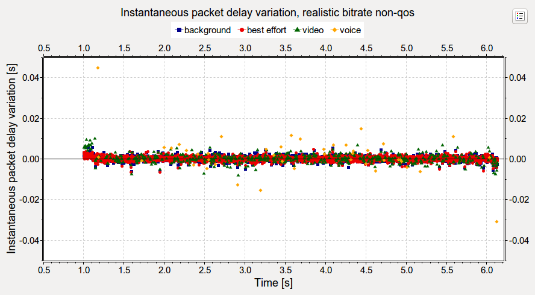

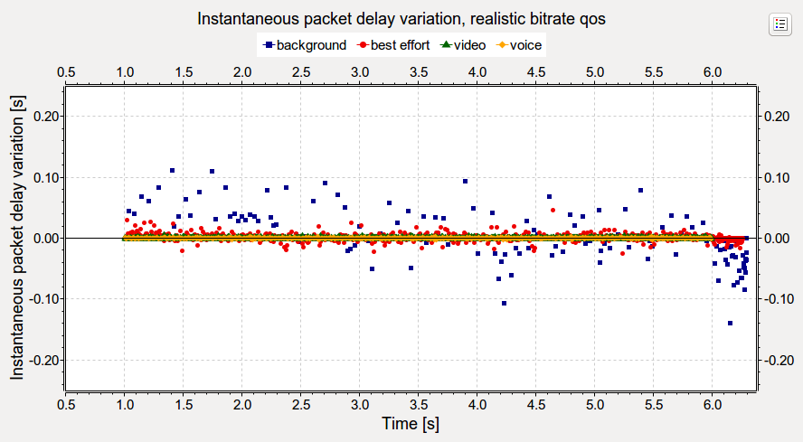

As with delay, the jitter is similar to the equal bitrate non-QoS case. In the QoS case,
there are more data points for the low priority packets. Still the there is more jitter
for the low priority packets at the end of the simulation, than there was for the high priority ones.

   Here is the QoS jitter chart zoomed in:

   .. figure:: jitterrealisticqos_zoomed.png
      :width: 100%

   The jitter for the higher priority (voice, video) packets, and some of the best effort ones are
   similar to the jitter in the non-QoS case, around 10ms. There are horizontal lines of data points
   on the zoomed in chart, on a different level for best effort and video. This regularity in the
   data is due to the lack of contention during a TXOP. The packets are generated every x seconds,
   and it takes y seconds to transmit them, both values are fairly constant. The difference between
   x and y appears as the horizontal lines.

Let's see the throughput:

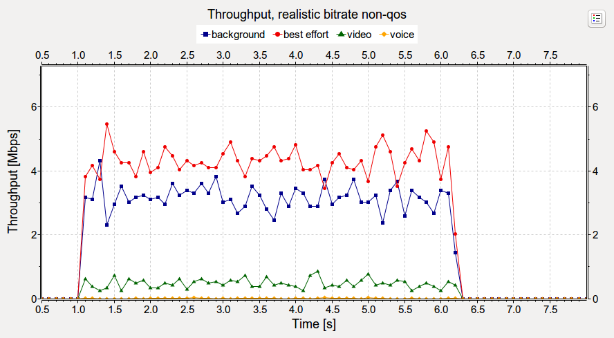

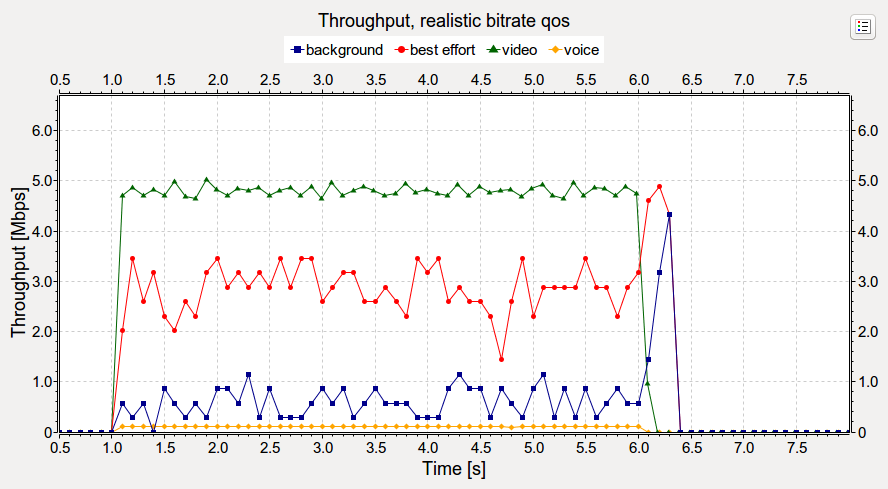

In the non-QoS case, the throughput for the four applications is more or less proportional
to their generated traffic (more for background and best effort, less for video
and even less for voice). However, none of the access categories can send data at the rate
the application is generating it.

In the QoS case, throughput for the video and voice categories can reach their nominal bitrate.
The throughput for the background and best effort categories is lower while the high priority
ones have data to send, and increases just a bit when the high priority traffic stops.

The bitrate of video and voice is lower than the others, but the others generate enough traffic
to saturate the channel on their own. Thus the video and voice categories still need QoS to
sustain nominal throughput.

Sources: :download:`omnetpp.ini <../omnetpp.ini>`, :download:`QosShowcase.ned <../QosShowcase.ned>`

Discussion
----------

Use `this <https://github.com/inet-framework/inet-showcases/issues/TODO>`__ page in the GitHub issue tracker for commenting on this showcase.
